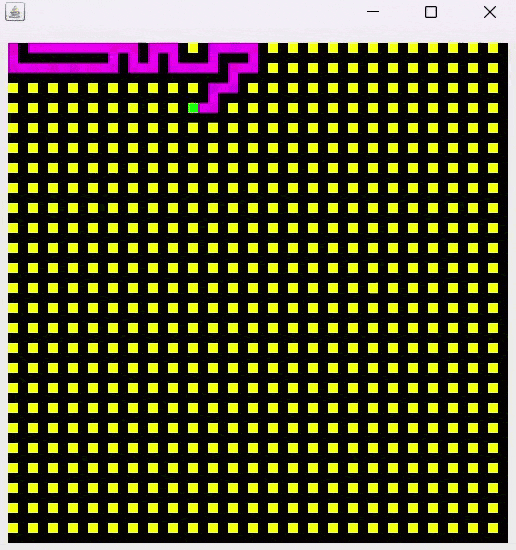

# Maze Generator and Pathfinding
This project implements a maze generator and pathfinding algorithm in Java 17. The goal is to generate a random maze and visualize it using a JPanel. Additionally, the project includes an algorithm for solving the maze by finding a path from the start to the finish.
## Maze Generator
The maze generation utilizes a randomized algorithm to create a maze with a specified layout. The cells of the maze are represented by a grid, and the algorithm carves passages through the maze randomly, creating a complex network of pathways and dead ends.
## Visualization
The maze is visualized using Java's JPanel to draw the maze on the screen. The cells, passages, walls, and solution path are displayed using different colors, providing a clear representation of the maze structure.
## Pathfinding Algorithm
The pathfinding algorithm aims to find the solution path from the entrance to the exit of the maze. The implemented algorithm explores the maze, considering possible paths and backtracking when necessary, until it finds the optimal route.
## Screenshots

## Used Tools
- __Java 17__
- __Swing (for GUI)__
- __JPanel for visualization__

## Acknowledgments
The project is inspired by the concept of maze generation and pathfinding algorithms. Special thanks to the Java programming language and the Swing library for providing the tools to create the graphical user interface.

Feel free to explore, modify, and integrate this code into your projects. If you have any suggestions or improvements, please contribute by creating a pull request. Enjoy navigating through the randomly generated mazes!
